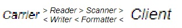

<details>
 
<summary>О проекте ...</summary>

# Благоразумное программирование

Среда в которой мы находимся может как помогать нам эволюционировать, так и наоборот - убивать всё ценное. Я к сожалению, опиравшись на популярные framework'и (копролиты), подножек и ловушек хорошо понаполучал. И понял, что текущее программирование пошло в сторону конфликта, и работает против новичков, то есть губит самое ценное и важное -> любознательность.


Это мне не понравилось, и я решил со всех реализованных framework сбросить лишнее (всю уёбищность и вредительство), дабы из ценного и нужного собрать стиль програмирования.
 


--------------------------------------------

</details>

### Субпроект "Конструктор бизнес кода"

Создавая оболочку для <a href="./Прототипы/Бизнес код/README.md">бизнес кода</a> я буду придержится анти-принципа грандиозности "заменимых не существует": 

1. никаких bild-версий / каждый файл меняется отдельно (в последовательности) наживую
2. меню будет и статичным и динамичным одновременно
3. новые файлы будут частью конструктора / картинки и pdf только через конструктор
4. права доступа / разработку можно залочить для паралельного участника


Задача перед средой разработки поставлю так: ресурсы как продолжение логики, процессы как продолжение конструкции.

Выделим их главные функции:

- упрощение в виде ресурсов продолжающие логику (практиковался на <a href="https://github.com/botogame/programming.prudence/blob/main/%D0%9F%D1%80%D0%BE%D1%82%D0%BE%D1%82%D0%B8%D0%BF%D1%8B/%D0%A6%D0%B5%D0%BD%D1%82%D1%80%D0%B8%D1%80%D0%BE%D0%B2%D0%B0%D0%BD%D0%BD%D1%8B%D0%B9%20%D1%81%D0%B0%D0%B9%D1%82/README.md">центрированном сайте</a>, есть прототипы)
- сбережение в виде процессов продолжающие конструкции (практиковался на <a href="https://github.com/botogame/programming.prudence/blob/main/%D0%9F%D1%80%D0%BE%D1%82%D0%BE%D1%82%D0%B8%D0%BF%D1%8B/%D0%A0%D0%B5%D0%B7%D0%BE%D0%BD%D0%B0%D0%BD%D1%81%D0%BD%D1%8B%D0%B9%20%D0%BA%D0%BE%D0%B4/README.md">резонансном коде</a>, есть прототипы)

Итогом должна образоваться среда разработки: ассертивный редактор (assertive_editor.exe).

Энергетику ассертивности хорошо показал Julien Doré в клипе <a href="https://www.youtube.com/watch?v=PtLPKvK4jv8&list=RDEMarcVqr-c-Xn4Wqnoz88aVw&index=2">Chou wasabi</a>: 


Ассертивность выстраивается на понимании. И в интернете про ассертивность иногда написано что нужно избавляться от паранойи, отнюдь не надо, а наоборот, эта необычная часть человеческого понимания о мире хорошо будет дополнять <a href="https://www.youtube.com/watch?v=KDXOzr0GoA4&list=RDEMarcVqr-c-Xn4Wqnoz88aVw&index=4">общую картину</a> редактора. Как и другие качества, которые вы не смогли проявить в других средах разработки.

Сделаем расположение на главной редактора кода только таких корневых конструкций:

- файловое хранилище
- html {5.3}
- php {7.2}
- javascript {1.8.5}
- css {3}
- mysql {5.7}

Здесь "файловое хранилище" как старый способ разработки, и туда, помимо картинок, будем объявлять выгрузку сформированных данных с "html", "php" в указанные файлы index.php, /shablons/main.html, style.css и т.п. Таким образом будут реально <a href="https://youtu.be/0J1fKBxK9Wc?t=101">скованные одной цепью</a>.

Изучаю Carrier Rider Mapper... 



Наверно буду первым кто грамотно это спроектирует для редактировании кода, наверно. 

Если по CRM зайти в редактор, то скорее всего нужно увидеть такую структуру файлов:

```
/📁site/📄index.php
       /📁index.php/📄main.html
                   /📁main.html/📄style.css
                   /📁main.html/📄favicon.png
                   /📁main.html/📄logotype.png
       /📁index.php/📄about.php
                   /📁about.php/📄body.html
       /📁index.php/📄news.php
                   /📁news.php/📄body.html
                   /📁news.php/📄table.html
                   /📁news.php/📄table_td.html
                   /📁news.php/📄script.js
                   /📁news.php/📄data.sql
```

А внутри каждого файла сплетение бизнес кода с корневыми конструкциями php, html, js, css, mysql и т.д..

Если вспомнить про MVC, то на файлах скорее всего будет так:

```
/📁site/📄.htaccess
       /📁.htaccess/📄index.php
                   /📁index.php/📄main.html
```
Где, 
1. Controller: 📄.htaccess
2. Model: 📄index.php
3. View: 📄main.html

Ещё бы в корень добавить 📄.gitignore чтобы отделить статику от динамики например для динамичного json файла:

```
/📁site/📄.gitignore
       /📁.gitignore/📄parsed_list.json
/📁site/📄.htaccess
       /📁.htaccess/📄index.php
                   /📁index.php/📄main.html
```

Рандомные файлы, которые будут генерироваться, фиксируем с помощью папки, добавляя {id}:

```
/📁site/📄.gitignore
       /📁.gitignore/📁upload_portfolio_{id}.pdf/📄.gitkeep
```

Данные редактора будет вносить в файл 📄.project по типу csv:

```
/📁site.ru/📄.project
/📁site.ru/📄.htaccess
          /📁.htaccess/📄index.php
                      /📁index.php/📄main.html
/📁site.ru/📄.gitignore
          /📁.gitignore/📁upload_portfolio_{id}.pdf/📄.gitkeep
```

Идею первичности php перед html можно изменить:

```
/📁site.ru/📄.htaccess
          /📁.htaccess/📄index.html
                      /📁index.html/📄get_content.js
                      /📁index.html/📄wait_main_request.php
```

Для гита мониторинг базы данных будет только за таблицами и системнымм даннымм:

```
/📁site.ru/📄.htaccess
          /📁.htaccess/📄таблицы.sql
```

За папки отвечает процессы, а за файлы логика.

Если соотнести бизнес код, то:
1. папка несёт в себе название и тип, где за папкой закреплен обработчик входящих и выходящих данных.
2. файл несёт в себе так же название и тип, где за файлом закреплена связь откуда и куда поступать данным.

Вложенность папок составляется за счёт необходимости применения конструкции в родительской конструкции. Например в таблицу нужно добавить системеные данные:

```
/📁site.ru/📄.htaccess
          /📁.htaccess/📄таблицы.sql
                      /📁таблицы.sql/📄системные_данные.csv
```

Или Javascript по ajax подгружает php:

```
/📁site.ru/📄.htaccess
          /📁.htaccess/📄index.html
                      /📁index.html/📄pages_load.js
                                   /📁pages_load.js/📄core.php
```

Гитигноры тогда нужно вмещать так:

```
/📁site/📄.htaccess
       /📁.htaccess/📄index.php
                   /📁index.php/📄.gitignore
                               /📁.gitignore/📄upload_portfolio_{id}.pdf
```

Ну если принять, что ресурс завязан на конструкции, то так:

```
/📄site.ru
/📁site.ru/📄.htaccess
          /📁.htaccess/📄index.php
                      /📁index.php/📄.gitignore
                                  /📁.gitignore/📄upload_portfolio_{id}.pdf
                                               /📁upload_portfolio_{id}.pdf
```

Информацию редактирования можно разнести по папкам в виде 📄.history:

```
/📁site.ru/📄.htaccess
          /📁.htaccess/📄.history
          /📁.htaccess/📄index.php
                      /📁index.php/📄.history
                      /📁index.php/📄.gitignore
                                  /📁.gitignore/📄.history
                                  /📁.gitignore/📄upload_portfolio_{id}.pdf
                                               /📁upload_portfolio_{id}.pdf/📄.history
```

Ограничений просмотра файлов-папок нет, для редактирования файлов (построение бизнес кода) можно ввести доступ по скилам (php-программист, html-л, css-ник и т.д.).

Определим врагов:
1. файлы могут быть дурными
2. папки могут быть бестолковыми

Чтобы исключить враждебность, введём разделение dev/prod разработки в сам редактор, и управление обновлением настроим посредством ftp и mysql, напрямую. Все настройки подключения будем записывать в файл вне корня сайта 📄site.ru.

```
/📄site.ru
/📁site.ru/📄.history
```

Теперь вольнодумные исследования завершены и выведем основу работы в редакторе:
1. выбираем тип конструкции
2. описываем её назначение
3. добавляем результат или тестовый пример

По первому пункту редактор загрузит соотвествующую конструкции форму. По второму пункту будет выбрано название или записано своё, описание и ключи-значения. По третьему можно загрузить бинарные файлы.

Итогом будет

```
/📄site.ru <-- mysql_local_host = localhost;
/📁site.ru/📄.history
/📁site.ru/📄.htaccess <-- RewriteRule ^(.*)$ /index.php?path=$1 [NC,L,QSA]
          /📁.htaccess/📄.history
          /📁.htaccess/📄index.php <-- процедурный код
                      /📁index.php/📄.gitignore <-- /.gitignore/upload_portfolio_???????????.pdf
                                  /📁.gitignore/📄.history
                      /📁index.php/📄main.tpl <-- smarty шаблон
                                  /📁main.tpl/📄.history
                                  /📁main.tpl/📄logotype.png <-- загрузили бинарный файл
                      /📁index.php/📄авторизация.sql <-- sql запросы
                                  /📁авторизация.sql/📄.history
                      /📁index.php/📄cart.php <-- процедурный код
                                  /📁cart.php/📄корзина.sql <-- sql запросы
                                             /📁корзина.sql/📄.history
```

Появление файлов в редакторе организовать по факту необходимости. Например при заполнении site.ru вы отметили использование .htaccess, только так он и появился, для чего то с соотвествующим названием для будущего заполнения.

Естественно нужно сделать из редактора такую взаимосвязь, чтобы можно было отследить что не используется (или в стадии разработки), например какая нибудь таблица была создана, а php ещё не взял в разработку.

<hr>

<h3>Спецификация</h3>

От понятия дублей кода придётся избавиться, вместо неё введём доступность с помощью вложения. Если необходим функционал-данные какого то внешнего файла - инициазируем алиас в подпапку, для дальнешего использования в режиме чтения.

```
/📁index.php/📄cart.php <-- процедурный код
            /📁cart.php/📄корзина.sql <-- sql запросы
                       /📁корзина.sql/📄.history
/📁index.php/📄user.php <-- процедурный код
             /📁user.php/📁корзина.sql/📄.history <-- алиас на /📁index.php/📁cart.php/📁корзина.sql/📄.history
```

<hr>

<h3>Как будем работать над таблицей</h3>

Например нужна таблица количества дней у месяцев по дням неделям:


Создаём 

```
/📄количества дней у месяцев по дням неделям.sql
/📁количества дней у месяцев по дням неделям.sql/📄.history
```

Далее в 📄.history с помощью редактора составляем код:

```
1.📁Конструкция "таблица"
  1.1.📄Ресурс "неделя"
      1.2.📁Конструкция "enum"
          1.2.1.📄Ресурс "январь"
                1.2.1.1.📁Конструкция "tinyint"
          1.2.2.📄Ресурс "февраль"
                1.2.2.1.📁Конструкция "tinyint"
          1.2.3.📄Ресурс "март"
                1.2.3.1.📁Конструкция "tinyint"
```

Запрос данных будет выглядить так:

```
1.1.📄Ресурс "неделя" = "вторник" / уходит в условие where
1.2.1.📄Ресурс "январь" = false / отсюда данные не нужны
1.2.2.📄Ресурс "февраль" = true / ожидаем отсюда данные

1.📁Конструкция "таблица" = request select / берём данные
1.2.2.1.📁Конструкция "tinyint" = sort asc / сортируем начиная с малого числа
```

Результат:

```
1.📁Конструкция "таблица" = answer array / получить результат в виде массива
```

или так:

```
1.0.[📁>]Процесс "request select"
  1.0.1.[📄]Логика "установить значение" = "неделя" = "вторник" / уходит в условие where
  1.0.2.[📄]Логика "установить значение" = "январь" = false / сюда данные не нужны
  1.0.3.[📄]Логика "установить значение" = "февраль" = true / ожидаем сюда данные
        1.0.3.1.[<📁]Конструкция "tinyint" = sort asc / сортируем начиная с малого числа
                1.0.3.1.1.[📄]Ресурс "данные какого то дня"
```

<hr>

<h3>Код на уровне модульности</h3>

Введём символизм:
1. 🎁 Конструкции
2. ⚙️ Процесс
3. 🔐 Логика
4. 📷 Ресурсы

Построим небольшую программку:

```
🎁 ядро
   📷 запрос на _get
        🔐 {установить значение} "do"
   ⚙️ получить с _get
   📷 результат с _get
   🎁 реакция
        🔐 {для} "📷 результат с _get" {если равен} "start"
               📷 текст для echo
                      🔐 {установить значение} "Привет мир!"
               ⚙️ вывести текст
        🔐 {для} "📷 результат с _get" {если равен} "exit"
               ⚙️ остановить скрипт
   🎁 остановка
        🔐 {для} "📷 результат с _get" {установить значение} "exit"
        📷 позиция конструкции
               🔐 {установить значение} "🎁 реакция"
        ⚙️ запустить конструкцию
```

Последовательность:
1. авто-запускается конструкция `🎁 ядро`
2. берётся значение с $_GET['do']: функция `⚙️ получить с _get` по значению `📷 запрос на _get` отдала результат в `📷 результат с _get`
3. запускается внутренняя конструкция `🎁 реакция`
4. выполняется условие: в нашем случае выполнится `⚙️ вывести текст` т.к. мы запустили скрипт с запросом ?do=start
5. так как в конструкции `🎁 реакция` всё, у конструкции `🎁 ядро` запускается следующая внутрення конструкция `🎁 остановка`
6. изменяем значение `📷 результат с _get`  на 'exit'
7. повторно запускаем конструкцию `🎁 реакция`
8. здесь срабатывает условие на exit, но даже если условия такого и не было, то после отработки запуска конструкции `🎁 остановка` не последовало бы (но отработались бы все конструкции что были бы внутри)

Сделаем так, чтобы `📷 ресурсы` и `⚙️ процессы` уже были полностью проработаны редактором, где выбирая `⚙️ процессы` подгружаем перед-после нужные `📷 ресурсы` (перед - то что подгружаются в `⚙️ процесс`, после - то что выгружается). Добавить `📷 ресурс` (и изменить название) запретим, только авто-подгрузка с добавленным `⚙️ процессом`.

По ходу работы, `🎁 конструкции` будут означать для вас как варианты, а `📷 ресурсы` будете использовать как фильтры. Попробуем построить запрос к таблице:

```
🎁 авторизованный пользователь
   📷 таблица запроса
        🔐 {установить значение} "users"
   📷 получить поля
        🔐 {установить в массив значение} "id"
        🔐 {установить в массив значение} "name"
        🔐 {установить в массив значение} "email"
   📷 условия отбора
        🔐 {установить в массив условие} "id" {=} "1"
   📷 позиция взятия
        🔐 {установить значение} {false}
   📷 количество
        🔐 {установить значение} "1"
   ⚙️ загрузить с таблицы
   📷 результат
```

Естественно мы должны в начале объявить о таблице:

```
🎁 таблица пользователей
   📷 название таблицы
        🔐 {установить значение} "users"
   📷 поля
        🔐 {установить в массив ключ-значение} "id" {=} "int"
        🔐 {установить в массив значение} "name" {=} "varchar 100"
        🔐 {установить в массив значение} "email" {=} "varchar 254"
        🔐 {установить в массив значение} "active" {=} "boolean not null"
   📷 первичный ключ
        🔐 {установить значение} "id"
   ⚙️ объявить таблицу
   📷 результат
```

И получим данные уже с неё:

```
🎁 авторизованный пользователь
   📷 таблица запроса
        🔐 {установить значение} "🎁 таблица пользователей / 📷 название таблицы"
   📷 получить поля
        🔐 {установить в массив значение} "🎁 таблица пользователей / 📷 поля / id"
        🔐 {установить в массив значение} "🎁 таблица пользователей / 📷 поля / name"
        🔐 {установить в массив значение} "🎁 таблица пользователей / 📷 поля / email"
   📷 условия отбора
        🔐 {установить в массив условие} "🎁 таблица пользователей / 📷 поля / id" {=} "1"
   📷 позиция взятия
        🔐 {установить значение} {false}
   📷 количество
        🔐 {установить значение} "1"
   ⚙️ загрузить с таблицы
   📷 результат
```

Соотвественно у каждой `🎁 конструкции` будет какой то готовый набор возможного применения `⚙️ процессов`. А для `📷 ресурсов` свои `🔐 логики`. Всё статично должно завиксировано в редакторе, который в дальнейшем автоматически соберёт код.

Так мы будем выстраивать <a target="_blank" href="https://github.com/botogame/programming.prudence/blob/main/%D0%9F%D1%80%D0%BE%D1%82%D0%BE%D1%82%D0%B8%D0%BF%D1%8B/%D0%A0%D0%B5%D0%B7%D0%BE%D0%BD%D0%B0%D0%BD%D1%81%D0%BD%D1%8B%D0%B9%20%D0%BA%D0%BE%D0%B4/README.md">резонансный код</a>.

<hr>

<h3>Код на уровне версионности</h3>

Чтобы не путаться в подобных цифрах - `31.0.2.1.212312.12332131232` будет закреплять модификации задачами проектов (`магазин / корзина`, `пользователи / фикс вывода #2`). Так мы сможем ввести загрузку на dev и prod только нужных модификаций. Единственно нужно обдумать как быть с теми конструкциями, которые были изменены по двум задачам (табу на ведение двух задач в смежных конструкций?).

Вначале будет первый проект `подготовка среды разработки` где задачей будет `настройка`, далее `подготовка среды разработки / навигация` и т.д. (`подготовка среды разработки / модули`, `подготовка среды разработки / тестирование`). Возможно можно будет по пути зафиксировать галочками "можно | нельзя изменять  другими задачами (проектами)".

Если хорошо подумать, то скорее каждый модуль нужно привести к такому изначальному проектированию:
1. настройка  - аккаунты, таблицы
2. контроль - определение места запуска, подключение к базе данных, ввод данных, стопперы, заглушки
3. реакции - обработка и вывод данных
4. модули - функциональные программы (настройка+контроль+реакции)

Или даже так (если следовать этапам разработки):

1. реакции
2. модули
3. контроль
4. настройки

По факту это будет так:

1. Проект
     - 1.1. задачи
     - 1.2. субпроекты
     - 1.3. цели
     - 1.4. ресурсы

Где отвественность:
1. целостность
     - 1.1. выполнение
     - 1.2. улучшение
     - 1.3. контроль
     - 1.4. организация

> <===== To be continued 
