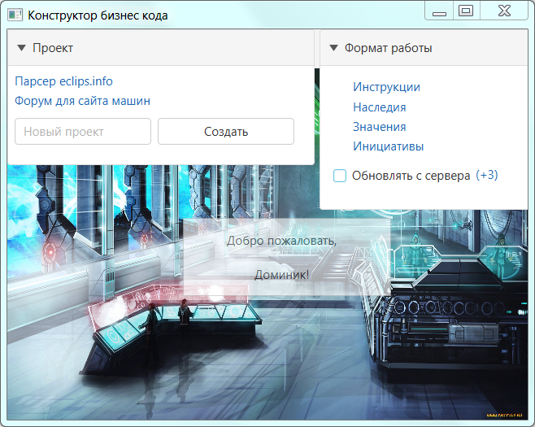

# Благоразумное программирование

Среда в которой мы находимся может как помогать нам эволюционировать, так и наоборот - убивать всё ценное. Я к сожалению, опиравшись на популярные framework'и (копролиты), подножек и ловушек хорошо понаполучал. И понял, что текущее программирование пошло в сторону конфликта, и работает против новичков, то есть губит самое ценное и важное -> любознательность.

Это мне не понравилось, и я решил со всех реализованных framework сбросить лишнее (всю уёбищность и вредительство), дабы из ценного и нужного собрать стиль програмирования.
 

--------------------------------------------
### Проект "Конструктор бизнес кода"

Создавая оболочку для <a href="./Прототипы/Бизнес код/README.md">бизнес кода</a> я буду придержится принципа грандиозности "заменимых не существует": 

1. никаких bild-версий проекта как у github / каждый файл меняется отдельно (в последовательности) наживую
2. меню будет и статичным и динамичным одновременно
3. новые проекты будут частью конструктора / картинки и pdf только через конструктор

