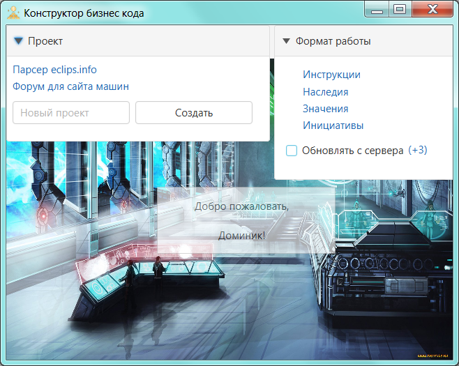

# Благоразумное программирование

Среда в которой мы находимся может как помогать нам эволюционировать, так и наоборот - убивать всё ценное. Я к сожалению, опиравшись на популярные framework'и (копролиты), подножек и ловушек хорошо понаполучал. И понял, что текущее программирование пошло в сторону конфликта, и работает против новичков, то есть губит самое ценное и важное -> любознательность.

Это мне не понравилось, и я решил со всех реализованных framework сбросить лишнее (всю уёбищность и вредительство), дабы из ценного и нужного собрать стиль програмирования.
 

--------------------------------------------
### Проект "Конструктор бизнес кода"

Создавая оболочку для <a href="./Прототипы/Бизнес код/README.md">бизнес кода</a> я буду придержится анти-принципа грандиозности "заменимых не существует": 

1. никаких bild-версий / каждый файл меняется отдельно (в последовательности) наживую
2. меню будет и статичным и динамичным одновременно
3. новые файлы будут частью конструктора / картинки и pdf только через конструктор
4. права доступа / разработку можно залочить для паралельного участника

Задача перед средой разработки поставлю так так: ресурсы как продолжение логики, процессы как продолжение конструкции.

Выделим их главные функции:

- упрощение в виде ресурсов продолжающие логику
- сбережение в виде процессов продолжающие конструкции

Итогом должна образоваться среда разработки: ассертивность (assertiveness.exe).

Энергетику ассертивности хорошо показал Julien Doré в клипе <a href="https://www.youtube.com/watch?v=PtLPKvK4jv8&list=RDEMarcVqr-c-Xn4Wqnoz88aVw&index=2">Chou wasabi</a>: 

> Далее думаю....
