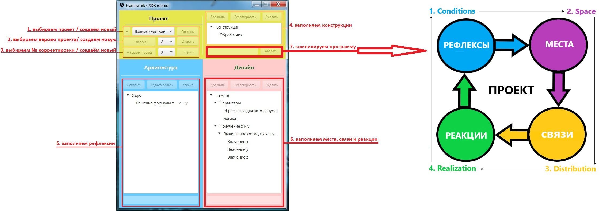
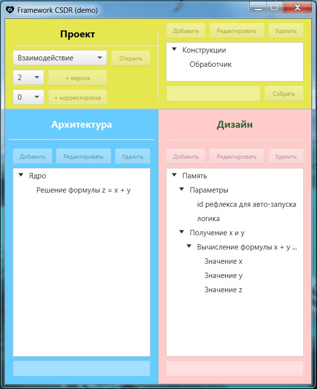
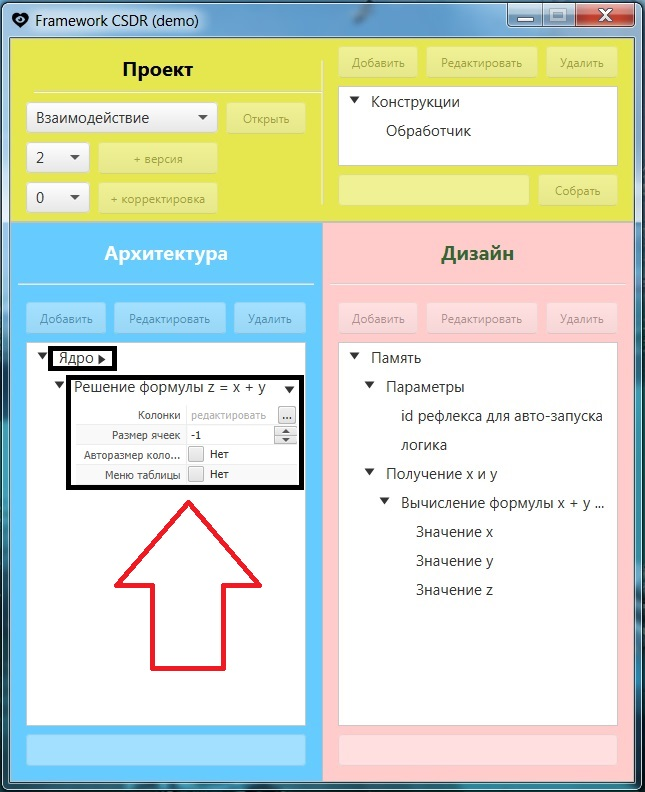
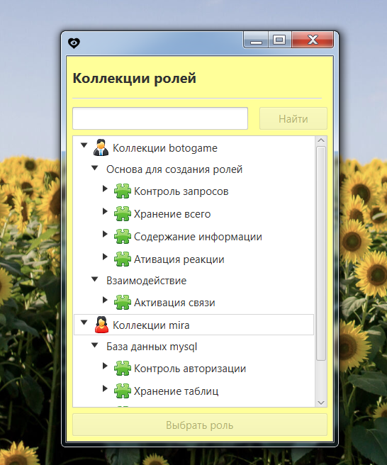

# Внешний вид программы

Общее представление о процессе программирования:

Каждый слой взаимосвязан по иерархии:

Программирование происходит в виде кликабельного и текстового ввода:

Каталог для модулей позволит сохранить опыт:

