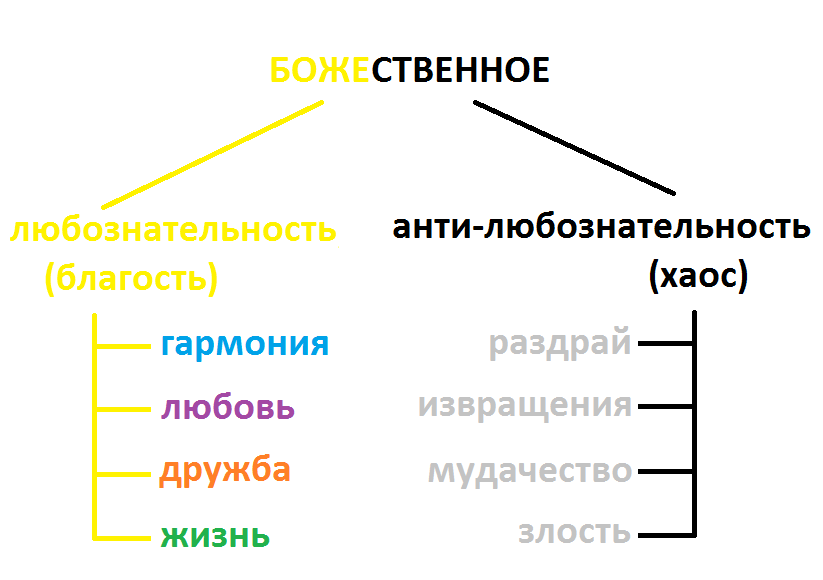

# Благоразумное программирование

Среда в которой мы находимся может как помогать нам эволюционировать, так и наоборот - убивать всё ценное. Я к сожалению, опиравшись на популярные framework'и (копролиты), подножек и ловушек хорошо понаполучал. И понял, что текущее программирование пошло в сторону конфликта, и работает против новичков, то есть губит самое ценное и важное -> любознательность.

Это мне не понравилось, и я решил со всех реализованных framework сбросить лишнее (всю уёбищность и вредительство), дабы из ценного и нужного собрать стиль програмирования.
 

--------------------------------------------

### Проект "Иное познание"

Мои иные познания в программировании начались со знакомства с <a target="_blank" href="https://пасьянс-медичи.рф">пасьянсом медичи</a>. Я увидел другой уровень программирования, более глобальный и стабильный.

### Цикл

Всё вокруг построено по 4-х мерию вписанный в цикл, где каждый елемент кормит следующий, облегчая-стимулируя деятельность. 

### Уклад

Человечество использует две социальные опоры:
1. дипломатия, опора на людей
2. тотальность, опора на законы мироздания.

### Всё есть Бог

Попытался вписать плохое положение дел в естественный ход порядка. Это неверный ход оказался. Грязь нельзя сделать чище.

### Человек и эпифиз

Выявил что шишковидная железа (эпифиз) и на самом деле важный элемент, хотя было время когда я считал его инородным, как контроль над человечеством. На деле это наш орган, чакра третьего глаза, побуждающая интерес жить следующим днём. Деньги должны были запитываться такой энергией на уровне государства (но сейчас наоборот, через деньги государство снимает эту энергии с населения). 

### Четыре рассы

Здесь я попытался изучить момент того, что нас объединяет. Я опирался на прошлые рассы. На деле я изучал чакру солнечного сплетения.

