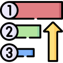

# Благоразумное программирование

Среда в которой мы находимся может как помогать нам эволюционировать, так и наоборот - убивать всё ценное. Я к сожалению, опиравшись на популярные framework'и (копролиты), подножек и ловушек хорошо понаполучал. И понял, что текущее программирование пошло в сторону конфликта, и работает против новичков, то есть губит самое ценное и важное -> любознательность.


Это мне не понравилось, и я решил со всех реализованных framework сбросить лишнее (всю уёбищность и вредительство), дабы из ценного и нужного собрать стиль програмирования.
 


--------------------------------------------

### Проект "Конструктор yii2"

После <a href="../Разоблачение yii2/README.md">разоблачения yii2</a> я выявил 3 класса, которых достаточно для образования модуля.


Для такого модуля достаточно трёх уровней в пространстве имён:
1. никнейм разработчика / команды,
2. название разработки,
3. название классов: ассоциация / сервис / микросервис.

С привязкой к какому-то единому регистратору имён будет 100% уникальность названия класса. Когда понадобится изменить не свой модуль, то достаточно будет сменить никнейм на свой для образования своей версионности.

По поводу __construct у ассоциации:
1. Для этой функции нужно ввести роль подготовки класса к работе, где нужно переменным выдавать значения по дефолту. 
2. Так же в __construct переменная класса может принять значение от внутренней функции. 
3. Входящих же параметров для __construct не должно быть.
4. Если нужна функциональность другого класса то нужный модуль нужно подключать здесь же, в __construct: <b>$this->module_parser = new /dominic_of_russia/parser_variation_2/association();</b>

Для корневого модуля namespace не понадобится:
```diff
$module_site = new association();
$module_site->response();
```

Для веб-версии подразумеваю, что сервис это html, микросервис это js, а ассоциация это и html и js.


------------------

### Декомпозиция.

Переобозначим приоритет папок yii2.



Классу controller'a дадим роль ассоциации с пресущими контролёрам функциям и ограничениями ассоциации. При этом:
   - экстенд controller'a подгрузит "app\components\\{name_controller}\service"
   - экстенд service'a подгрузит "app\components\\{name_controller}\microservice"
   - экстенд microservice'a подгрузит "yii\web\Controller"

Классы models'ей сделаем полностью db'шно-обособленными и ссылки на них будут обозначаться только в construct() котролёра. Как собственно и все "use" перейдут в construct().

Подытожим приоритет папок:
1. controllers
2. components
3. vendor + config
4. models + migrations


------------------

### Разработка.

Для редактора разработки сделаем упор на проработку внутренностей функционала. Остальное вынесем на кликабельный вариант:  


Работа над контролёрами будет основным костяком программы по затраченному времени. Выставим его первым в списке.

Справа редактора будет работа над кодом, слева кликабельное функциональное меню, где:

1. Команды редактора это стандартные {Name}Controller. Подгруппа в редакторе их action{Name}.
2. Информация это вспомогательный сервис котролёра с категориями: получить, сохранить.
3. Обработчик это вспомогательный микросервис контролёра с категориями: создать, изменить.
4. Кнопка "внедрить в код" даст возможность:
 - выбрать входящие и исходящие переменные.
 - для редактора работы с информацией добавить функцию из отдела "базы данных".
 - для редактора обработчика даст возможность добавить функцию из отдела "модули".


------------------

### Проверка.

Тестирование переведём в режим "перед сохранением - тестируем". Соотвественно для полного тестирования введём проверку не только отдельной функции, но и других взаимосвязанных функций.


Этапы проверки:
1. Формирование типизации входящих и исходящих параметров.
2. Формирование примера для входящих и исходящих параметров.
3. Проверка орфографии функционала.
4. Проверка правильности выдачи результата у функции.
5. Проверка правильности выдачи результата у смежных функций.
6. Проверка стресоустойчивости.


------------------

### Расширение.

Для повседневных функций введём расширение в виде "общей функции". Так любая функция, в дальнейшей перспективе, может быть доступной для других команд.


Расширение сделает общими так же и все взаимосвязанные функции.

------------------

### Сведение.

Модуль у нас будет содержать три позиции:
- композёра
- config web
- автоматический поиск классов

