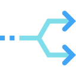

# Благоразумное программирование

Среда в которой мы находимся может как помогать нам эволюционировать, так и наоборот - убивать всё ценное. Я к сожалению, опиравшись на популярные framework'и (копролиты), подножек и ловушек хорошо понаполучал. И понял, что текущее программирование пошло в сторону конфликта, и работает против новичков, то есть губит самое ценное и важное -> любознательность.


Это мне не понравилось, и я решил со всех реализованных framework сбросить лишнее (всю уёбищность и вредительство), дабы из ценного и нужного собрать стиль програмирования.
 


--------------------------------------------

### Проект "Разоблачение yii2"

С контролеров всё должно начинаться. Это главные классы для остальных классов. И естественно своевольным программистам на это наплевать.


##### Вместо контролёров делают редиректы.

Вы не увидите в контролёрах подчинённых одной цели классов, там будет бурда вызывания других классов, которые распределены по смысловой нагрузке, порождающие новые смысловые нагрузки.

##### Надо понять цели.

Прежде всего нужно разобрать по полочкам чьи интересы вы должны вложить в контроллеры, свои или заказчика.

Когда вы поняли что контроллеры должны содержать ТОЛЬКО список интересов заказчика, то уже отсюда вы должны выстраивать иерархию классов нужных этому интересу ПРОЦЕССОВ.

Классы процессов должны содержаться и поддерживаться на все 100% вашими личными интересами. Заказчик будет только за.

------------------

### Рендеринг yii2 не интегрируется?

Обычно рендеринг это манипуляции с переменными в классе и ещё переменными в функциях, наложенными на html-js.


##### Проблему 100% поймёт FullStack.

Когда нибудь, да встанет проблема в человеческой памяти, которая когда нибудь да забудет положить переменную и цеплялку в ОДНО классовое место, отчего в дальнейшем хаос и отчаяние дальнейшей разработки.

##### Определите одно единственное место для обращения.

Делать не просто классы, а классы с рефлексией. Где пространство имён будет наследоваться от главного класса, как микро-сервиса, с вложенными классами внутренних процессов.

А так же нужно чтобы из одного класса микро-сервиса нельзя было НАПРЯМУЮ юзать класс процессов другого класса микро-сервиса, а только по методу интеграции, обращаясь "командой" к самому микро-сервису.

Если у класса микро-сервиса нет нужных команд, создавайте.

------------------

### Ошибки yii2 ловятся только тестами?
По принятому прошлому программисты продумывают код в голове, растасовывают его в разные папки, проверяют работоспособность и создают на него тест.


##### Отдел highload меня поймёт.

Здесь буду краток, когда наберётся много функций, редактировать ещё и тесты - затратно, по причине разброса этих функций по разным файлам.

##### Нужна типизация yii2.

Если всё начинается с контролеров, то надо сконцентрировать все папки в контролерах.

То есть контролеры сконструировать такими:

```diff
- контролер запросов
  - контролер базы данных
     - контролер функционала
       - контролер вёрстки
         - контролер css
         - контролер images
         - контролер javascript
```

Где вложенность соответствует последовательности формирования результата для браузера/консоли по стандартам программирования yii2.

Содержимое же сделать в виде статичных команд, принял то-то, создал это и передал результат вышестоящему контролёру.

------------------

### JavaScript у yii2 обособлен?

Это тот случай когда программист сворачивает в не туда, вместо js применяя php.



##### Лингвисты схватятся за голову.

Был фронтед, а стал бэкендоФронтедо, и фронтедоБэкендо одновременно.

##### Нужно всё делать заблаговременно.

То есть не должно быть так, что подбор переменных проводился в views. Всё должно быть предопределено в models. Дальше эти данные должны вписаться в js-assets, которые и сформируют views.

Отчего получится уже такая иерархия конструкций:

```diff
- контролер javascript
    - контролер вёрстки
    - контролер css
    - контролер images
```

------------------

### Идентификаторы в yii2 случайны?

Подключённые к проекту новые верстальщики не раз будут теряться в поисках нужного файла.


##### Загадка дыры.

Мы смотрим в исходный код, но не видим какие файлы собирали эту вёрстку.

##### Тэг section поможет.

Этот тэг специализирован для подсадки к нему js. Здесь можно хранить данные для js, с помощью которых можно оживить вёрстку.

И этот тэг должен создаваться не в js и html, а на стадии написания функционала в php. Все переменные со значениями должны попасть в этот тэг.

------------------

### Результат yii2 не сфокусирован?
Стандарты не всегда соответствуют текущим потребностям.


##### У кого завал работы - меня поймёт.

Покрывшись в деятельность, обычно забывают о модернизации, пока становится не поздно.

##### Надо знать что в итоге.

А в итоге у нас браузеры, которые считывают результат всей вашей деятельности. И нужно сконцетрировать внимание на их компромиссе, едином стандарте написания кода.

Отсюда (с конечной станции) надо выработать строгий шаблон html-а, который более приближен к компромиссу.

Содержимое head:

- ссылки на файлы и скрипты от контролёра js
- ссылки на файлы и стили от контролёра css
- данные заголовка, описания, ключей и др. от контролёра функционала


Содержимое body:

- сектора с данными от контролёра функционала
- вёрстка с идентификаторами в сектора от контролёра вёрстки

------------------

### Php в yii2 не даёт стабильный код?
Бэкенд (англ. back-end) — программно-аппаратная часть сервиса, но сейчас для программистов это не так.


##### Ищут баг в php, но он не там.

Переходят на поиски в html, js и т.д. теряя драгоценное время.

##### Нужна стабильность - придерживайся принципа стабильности.

Браузер дал программистам два языка:

Один html отвечающий за бэкенд, второй js отвечающий за фронтед. Фуллстеки это те, которые умеют работать и с тем и с тем.

Линукс ушёл в подполье в виде php:

Чтобы сохранить свою идентичность здесь работа с базой данных приняла роль бэкенда, а обработка информации на выдачу - фронтед.

Бэкенд это самодостаточная система. А вот фронтед это система нужд и потребностей, а точнее коннекторы для других фронтедов.

Это принцип объединения двух фуллстеков и более.

------------------

### Запросы у yii2 только в базу?

Программистам нужны деньги, а код лишь средство к существованию.


##### Fatal error: dont connect to data_base 91.1.2.4

И не понять теперь, причём здесь не-работа базы данных?, когда нужен был html.

##### JavaScript тоже должен реагировать на запрос.

Ведь запрос все файлы должен объединять:

```diff
      - контролер базы данных - php
   - контролер функционала - php
 - контролер запросов - браузер
   - контролер распределения - javascript
      - контролер вёрстки - html
      - контролер вёрстки - css
      - контролер вёрстки - images
```

------------------

### Что вообще такое контролёры?

Это главный класс который должен запускать весь функционал и для других классов должен стоять запрет на extends его. По русскому я бы назвал этот класс "классом ассоциаций", а все его дочерние классы "классами сервиса и микросервиса".


И добавил бы ещё особенности для главного класса:
- единственное право на образование главным объектом.
- единственное право на "public function __construct()".
- единственное право на отлов и реагирование на errors.

Пример контролёра "Association_www_site_to_parse_com" в <a href="./Скрипты/prew_1.php">этом коде</a>.

Здесь связка такая: Association_{name} <- Service_{name} <- Microservice_{name};

Где:
- Association - реагирует на запросы,
- Service - получает и сохраняет информацию,
- Microservice - обрабатывает информацию.